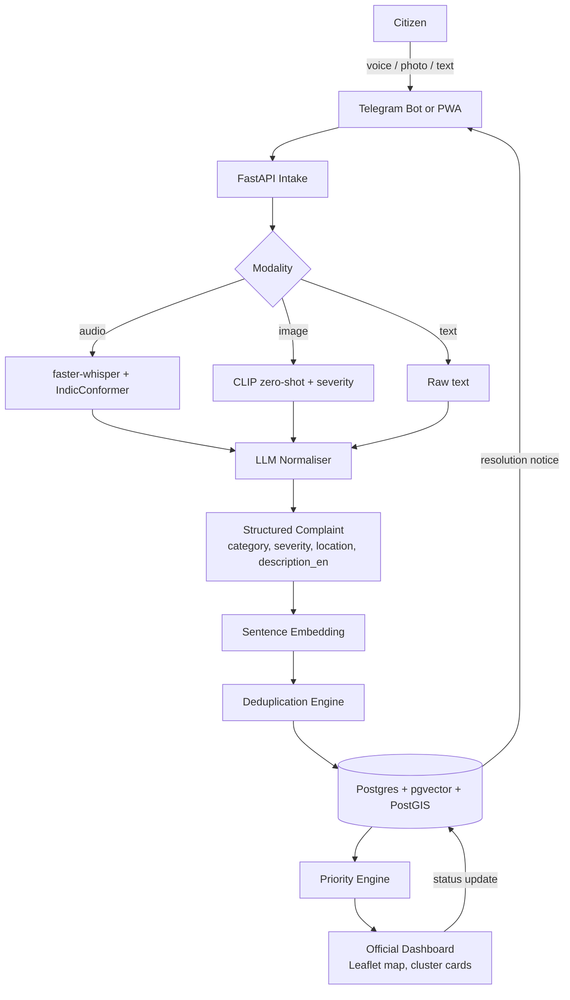
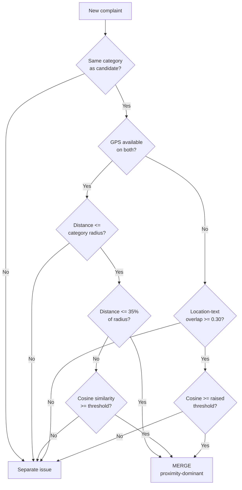

# NagarAI — System Architecture

## 1. Objectives

| # | Objective | How it is measured |
|---|---|---|
| O1 | Accept a complaint as voice, photo, or text in Tamil, Hindi, or English, in any combination | A Tamil voice note with a sideways photo produces a complete structured record |
| O2 | Convert any intake into one structured complaint | `{category, location, severity, description}` populated with no manual entry |
| O3 | Merge complaints describing the same physical issue | Correct clustering of the 15-complaint judging set |
| O4 | Rank issues by a formula an official can read and defend | Formula and per-issue breakdown visible on the dashboard |
| O5 | Give a ward officer a queue they would actually work from | Map, filters, cluster cards, one-click status update |

Out of scope: municipal workforce scheduling, payments, inter-department
ticketing beyond routing.

## 2. High-level flow



## 3. Deduplication cascade



**Why three stages rather than one embedding threshold.** Category and geography
are cheap, hard constraints that eliminate the two classic failure modes of pure
embedding clustering: a pothole merging with a garbage pile two metres away
because both descriptions mention the same landmark, and two genuinely different
potholes in different wards merging because the wording is nearly identical.
Semantic similarity then acts on the small set of candidates that survive.

**Per-category merge radii.** Waterlogging spreads along a stretch of road and
uses 200 m; a garbage bin is a point and uses 60 m. A single global radius is
wrong for both.

**Proximity-dominant shortcut.** Two same-category complaints within 35% of the
radius are treated as the same physical spot regardless of wording. Demanding
textual agreement at 13 m loses recall on terse, mistyped, or code-mixed reports
without preventing any realistic false merge.

## 4. Priority model

```
priority = S² × (1 + ln N) × (1 + D/7) × P
```

| Term | Meaning | Source |
|---|---|---|
| S | Severity 1–5 | Vision model plus category rule table, never citizen adjectives |
| N | Unique reporters in the cluster | Distinct hashed citizen IDs, not complaint count |
| D | Days pending, capped at 30 | Oldest complaint in cluster |
| P | 1.25 within 200 m of a school or hospital, else 1.0 | Geocoded sensitive sites |

Hazard categories — live wire, gas leak, open manhole, wall collapse — are placed
in a separate lane that always sorts above the routine lane.

**Worked example, from the problem statement.**

| Issue | S | N | D | Score |
|---|---|---|---|---|
| Pothole, 40 reports | 2 | 40 | 6 | 2² × (1+ln 40) × (1+6/7) = **34.83** |
| Live wire, 2 reports | 5 | 2 | 1 | 5² × (1+ln 2) × (1+1/7) = **48.38** |

Severity squared and headcount logarithmic: the hazard wins on score alone, and
the hazard lane makes that structural rather than a lucky parameter choice.

**Gaming resistance.**

| Attack | Defence |
|---|---|
| One person files 40 times | Deduplication merges them; N counts unique citizen IDs |
| A WhatsApp group brigades a minor issue | ln damping — 40 reporters is 4.7×, not 40× |
| Citizen exaggerates in the complaint text | Severity comes from the image classifier, not adjectives |
| Trivial issue floats up by ageing | D capped at 30 days |

## 5. Technology choices

| Layer | Choice | Reason |
|---|---|---|
| Intake | Telegram bot | Native voice notes, photos with EXIF, GPS share; no install, no API approval delay |
| Backend | Python + FastAPI | All ML libraries are Python; async matters because ASR and vision block for seconds |
| ASR | faster-whisper (int8) + IndicConformer | 4× faster than vanilla Whisper on CPU, runs offline; IndicConformer covers Tamil where Whisper is weaker |
| Vision | CLIP zero-shot | No civic-defect dataset exists off the shelf and YOLO has no pothole class; zero-shot works immediately |
| Embeddings | all-MiniLM-L6-v2 on normalised English text | Fast, 384-dim; normalising to English first makes Tamil, Hindi, and English complaints directly comparable |
| Storage | Postgres + pgvector + PostGIS | One query does "same category, within 100 m, cosine > threshold" |
| Dashboard | React + Leaflet + OpenStreetMap | No API token, no quota, offline tile caching possible |

## 6. Known limitations

Stated openly because the ground rules award marks for it.

1. CLIP zero-shot severity is coarse. Area-fraction bucketing approximates
   extent; it is not a calibrated measurement.
2. Whisper is weaker on Tamil than on Hindi. Heavily code-mixed speech degrades
   the transcript, which degrades the embedding.
3. The TF-IDF fallback embedder misses paraphrase pairs that share no vocabulary
   — for example, "knee deep waterlogging on the service road" and "stagnant
   rainwater flooding the stretch" are the same issue but do not merge without
   sentence embeddings. Demonstrated on complaints C011 and C012.
4. Merge radii and thresholds are hand-tuned on a 15-complaint set. They are not
   validated at municipal scale.
5. Sensitive-site proximity uses a small hardcoded list, not a full facility
   registry.
6. No adversarial testing against coordinated false reporting beyond the
   structural defences described above.
